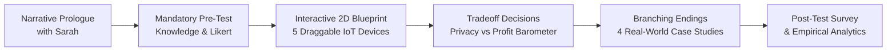

# 🏠 TrustTrail: Build Your Smart Home Startup

> **An Interactive Decision Simulator for Teaching Informed Consent & Privacy Engineering in IoT**  
> *Course 953420: Ethics and Professionalism for Software Engineers*  
> *College of Arts, Media, and Technology (CAMT), Chiang Mai University*

[](https://trust-trail-game.vercel.app/)
[](https://www.camt.cmu.ac.th/)
[](https://react.dev/)
[](https://tanstack.com/router)
[](https://tailwindcss.com/)
[](LICENSE)

---

## 🌐 Live Platform Access

| Service | URL | Description |
| :--- | :--- | :--- |
| 🚀 **Production Simulator** | [https://trust-trail-game.vercel.app/](https://trust-trail-game.vercel.app/) | Primary interactive game platform deployed on Vercel Global Edge Network |
| 📊 **Evaluation Results** | [https://trust-trail-game.vercel.app/results](https://trust-trail-game.vercel.app/results) | Live real-time dashboard displaying empirical data collected from participants |
| 🔄 **Mirror Backup** | [https://trust-trail-game.lovable.app/](https://trust-trail-game.lovable.app/) | Secondary mirror deployed on Lovable CDN |

*Note: No login or special credentials required. Best experienced on modern desktop or tablet browsers (Chrome, Edge, Firefox, Safari).*

---

## 📖 Pedagogical Purpose & Problem Framing

In modern software and embedded systems engineering, technical choices directly dictate civil liberties and personal privacy boundaries. However, traditional computer ethics education frequently suffers from abstract, lecture-based memorization of statutory codes (e.g., memorizing ACM code numbers or GDPR clauses) without emotional or commercial context.

**TrustTrail** bridges this pedagogical gap by seating the student in the founder's chair of an early-stage smart home startup on Day One. The player makes five authentic product calls under realistic startup constraints:
- **Commercial Temptations:** High review velocities, runway urgency, and venture capital pressure.
- **Cognitive Shift:** Moving students from legalistic box-checking (*"Users clicked accept on a 40-page EULA"*) to genuine **Informed Consent by Design** (*"Did users meaningfully understand what they consented to?"*).

---

## 🎮 Core Interactive Mechanics



1. **Narrative Prologue (Sarah's Briefing):** A visual novel dialogue with Sarah (Product Lead) establishing startup runway pressure and launch urgency.
2. **Pre-test Baseline:** 5 scenario-based ethical calls and 5-point Likert attitudinal scales before entering the home.
3. **Interactive 2D Blueprint:** Drag-and-drop hardware shelf featuring 5 devices:
   - 🎙️ **Smart Speaker** (Living Room): Wake-word activation vs. always-on ambient recording.
   - 📹 **Security Camera** (Hallway): 24-hour auto-deletion vs. infinite cloud archive retention for AI model training.
   - ⌚ **Fitness Wearable** (Bedroom): Subscription revenue vs. selling behavioral health signals to insurance brokers.
   - 🔔 **Video Doorbell** (Front Entryway): Strict judicial warrants vs. warrantless police portal integration.
   - 📺 **Smart TV** (Media Den): Explicit user re-consent prompt vs. silent background firmware update for ACR ad-tracking.
4. **Mental Model Misplacement Capture:** If a player drops a device into an unexpected room, a non-punitive modal (*"What made you think of that connection?"*) logs their mental model without penalty.
5. **Real-Time Live Data Trail:** An interactive network visualizer that exposes invisible packet transmissions, local edge filtering, and third-party data broker telemetry.
6. **4 Branching Endings Tied to Real Controversies:**
   - 🛡️ **The Product They Can Actually Trust:** Rare gold-standard privacy engineering.
   - 🚗 **The Quiet Premium Hike:** Inspired by the *General Motors / LexisNexis* connected car insurance controversy.
   - 🚪 **The Network They Never Joined:** Inspired by *Amazon Ring*'s warrantless law enforcement partnerships.
   - 📺 **The Update Nobody Read:** Inspired by smart TV / wearable automated content recognition (ACR) firmware updates.
7. **Post-Test & Analytics:** Mandatory knowledge re-assessment, reflection prompt, and real-time computation of Hake's normalized gain.

---

## 📊 Empirical Evaluation Findings ($N = 10$)

Evaluated with $N = 10$ fourth-year undergraduate Software Engineering students at CAMT, Chiang Mai University:

| Assessment Metric | Pre-Test Baseline | Post-Test Result | Net Shift ($\\Delta$) | Statistical Significance |
| :--- | :---: | :---: | :---: | :---: |
| **Knowledge Score Mean** | **2.10 / 5.00** (42.0%) | **4.60 / 5.00** (92.0%) | **+119.0%** | $p < 0.001$, Normalized Gain $\\langle g \\rangle = 0.862$ |
| **Acoustic Surveillance Mastery** | 30.0% | 90.0% | **+60.0%** | Understood always-on ambient recording risks |
| **Data Aggregation Mastery** | 50.0% | 100.0% | **+50.0%** | Realized data broker reconstruction risks |
| **Engineer Personal Responsibility** | 3.30 / 5.00 | 4.90 / 5.00 | **+48.5%** | Fostered ethical developer agency |
| **Trust in Vendor Defaults (Reverse)**| 4.00 / 5.00 | 1.30 / 5.00 | **-67.5%** | Successfully dismantled blind trust in defaults |
| **Platform Pedagogical Satisfaction**| — | **9.40 / 10.0** | 100% Positive | Strongly Agree (70%), Agree (30%) |

---

## 🛠️ Tech Stack & Architecture

- **Frontend & UI:** [React 19](https://react.dev/), [TypeScript](https://www.typescriptlang.org/), [Tailwind CSS v4](https://tailwindcss.com/), [Radix UI](https://www.radix-ui.com/), [Lucide Icons](https://lucide.dev/)
- **Routing & Framework:** [@tanstack/react-router](https://tanstack.com/router), [@tanstack/react-start](https://tanstack.com/start)
- **Server Engine & Build:** [Nitro Engine](https://nitro.unjs.io/) with Vite 8
- **Deployment Target:** [Vercel](https://vercel.com/) (Serverless Build Output API v3 with `NITRO_PRESET=vercel`)
- **Data Persistence:** Client-side reactive participant storage with `localStorage` fallback and dynamic CSV export

---

## 💻 Local Development Setup

### Prerequisites
- [Node.js](https://nodejs.org/) (version 20+ recommended)
- `npm` or `pnpm`

### Installation
```bash
# Clone the repository
git clone https://github.com/Kokokua/trust-trail-game.git
cd trust-trail-game

# Install dependencies
npm install

# Start local development server
npm run dev
```
Open [http://localhost:5173](http://localhost:5173) in your browser.

### Production Build & Preview
```bash
# Build for production (default Cloudflare / Nitro module)
npm run build

# Build specifically for Vercel
NITRO_PRESET=vercel npm run build

# Preview production build locally
npm run preview
```

---

## 👥 Project Team & Academic Attribution

**Course:** 953420 Ethics and Professionalism for Software Engineers  
**Group Number:** Group 16  
**Institution:** College of Arts, Media, and Technology (CAMT), Chiang Mai University  

### Team Members
1. **662115015** — Natthaphong Kangkantam
2. **662115026** — Nawapon Sriboonreang
3. **662115035** — Phutthichai Hankamjohn
4. **662115039** — Manapat Kaewlai

### Project Advisors
- **Asst. Prof. Dr. Pradorn Sureephong**
- **Asst. Prof. Dr. Suepphong Chernbumroong**

---

## 📄 License

This educational platform is released under the [MIT License](LICENSE).
